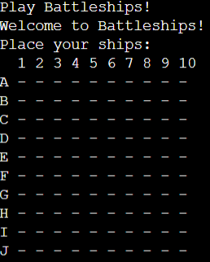

# Battleships Game

This is my take on the classic Battleships game. Placing your ships on a 10x10 grid and taking turns against the AI to see who can sink the other players ship by guessing their locations faster.

The live link can be found here - https://niall-battle-ships-67a649243d8a.herokuapp.com/

## How to Play
1. **Setup**: 
   - You and the AI will place ships on separate 10x10 grids.
   - Each player has ships of varying sizes (3, 4, and 5 units).
   - You will manually place your ships by entering a starting coordinate and specifying horizontal (H) or vertical (V) orientation.
   - The AI randomly places its ships on its grid.

2. **Gameplay**:
   - Players take turns to guess a location on the opponent's grid.
   - Enter a coordinate (e.g., A5) to attack that position.
   - The game will notify you if it's a **hit** (successful attack) or a **miss**.
   - If all segments of a ship are hit, the ship is sunk.
   - The AI also takes turns trying to sink your ships.

3. **Winning the Game**:
   - The game ends when all ships of either the player or the AI are sunk.
   - The first player to sink all the enemy ships wins.

## Features

### Existing Features:
- **10x10 Grids**: Both the player and AI use grids for ship placement and attacks.

- **Manual Ship Placement**: The player can choose where to place ships and their orientation.

- **AI Ship Placement**: The AI randomly places its ships on the grid, ensuring no overlap or out-of-bounds ships.
- **Turn-Based Attacks**: Each turn, the player and AI take turns guessing a location to attack.

- **Hit/Miss Feedback**: The game informs the player whether they hit, missed, or sunk an enemy ship.

- **Game Over Detection**: The game automatically detects when all ships on one side have been sunk.

### Future Features:
- **Ship Randomization Option**: Allow players to randomize ship placement if they prefer not to place manually.
- **Difficulty Levels**: Add AI difficulty settings (e.g., easy, medium, hard) for smarter move strategies.
- **Multiplayer Mode**: Implement an option for two players to play against each other.
- **Replay Option**: Add a feature to restart the game after a match is over without exiting the program.
- **Visual Effects**: Incorporate animations or enhanced visuals to show hits, misses, and sunk ships.

## Data Model

### Classes:
1. **Ship**: 
   - `size`: The length of the ship (e.g., 3, 4, or 5 units).
   - `hits`: Tracks how many times the ship has been hit.
   - `coordinates`: Stores the ship's position on the grid.
   
2. **GameState**: 
   - `player_turn`: A boolean flag to track if it is the player’s turn.
   - `game_over`: A boolean flag to indicate if the game is over.
   - `player_ships`: A list of the player's ships.
   - `ai_ships`: A list of the AI’s ships.

### Functions:
- **`create_grid()`**: Creates a 10x10 game grid represented as a 2D list.
- **`print_grid(grid, hide_ships=False)`**: Displays the grid, optionally hiding the positions of ships.
- **`is_valid_placement(grid, ship, row, col, orientation)`**: Checks whether a ship can be placed at the specified coordinates and orientation.
- **`place_ship(ship, row, col, orientation)`**: Places the ship at the specified position on the grid.
- **`place_player_ships(grid, ships)`**: Allows the player to manually place ships on their grid.
- **`place_ai_ships(grid, ships)`**: Randomly places the AI’s ships on the grid.
- **`player_turn(grid, ships)`**: Handles the player's turn by prompting for a move and checking if it’s a hit or miss.
- **`ai_turn(grid, ships)`**: The AI randomly selects a target on the player’s grid to attack.
- **`check_game_over(ships)`**: Checks if all ships of a player or AI have been sunk, signaling the end of the game.

## Testing:

| **Test Category**  | **Test Case**                                        | **Expected Result**                                                   | **Pass/Fail** |
|-------------------|------------------------------------------------------|-----------------------------------------------------------------------|---------------|
| **Functional Tests** | Player can place ships without overlap               | Ships should be placed correctly without overlapping on the grid       | Pass          |
|                   | Player can place ships within grid boundaries         | Ships should not exceed the grid boundaries (both horizontal and vertical) | Pass          |
|                   | Player receives feedback for a hit                    | When a player hits a ship, the cell should be marked as "X" and a hit message should appear | Pass          |
|                   | Player receives feedback for a miss                   | When a player misses, the cell should be marked as "M" and a miss message should appear | Pass          |
|                   | Player receives feedback for sinking a ship           | When all parts of a ship are hit, a message indicating the ship has sunk should appear | Pass          |
|                   | Ships are correctly marked as "S" on the grid         | Ships should be visible on the player's grid and hidden on the AI's grid (unless configured otherwise) | Pass          |
| **AI Testing**    | AI places ships without overlap                       | AI ships should not overlap each other                                | Pass          |
|                   | AI places ships within grid boundaries                | AI ships should not exceed the grid boundaries                        | Pass          |
|                   | AI makes valid moves                                  | AI should not target the same location twice and should target valid grid cells | Pass          |
| **Game Flow**     | Player and AI turns alternate correctly               | The game should alternate between the player's turn and AI's turn     | Pass          |
|                   | Player can’t make a move during AI’s turn             | During the AI's turn, the player should be unable to make a move      | Pass          |
| **Edge Cases**    | Invalid coordinates input (e.g., Z5)                  | Game should display an error message and ask for valid input           | Pass          |
|                   | Repeated move (e.g., A1 after already selecting it)   | Game should display a message saying the move was already made        | Pass          |
|                   | Out-of-bounds placement for ships (e.g., too large for the grid) | Game should prevent ship placement and display an error               | Pass          |

## Bugs

### Solved Bugs
1. **Infinite Looping**: When finished placing ships the game would start infinitly loading a new board. added player/ai logic and game state checks to fix this.
2. **Linter Error** Issues with lines longer that 79 spaces and blank spaces. Able to fix using CI Python Linter.

### Remaining Bugs
- There are currently no remaining bugs.

### Validator Testing
- PEP8 No errors showing.

## Deployment

The following steps were taken to deploy the game.
- Create a new Heroku App
- Set the build packs to Python and Node.js in that order
- Link the Heroku App to the repository
- Click deploy

## Credits
- Code Institutes Love Sandwiches project for set up and revision on functions.
- W3 schools for tips and general enquires.
- Code Institute for Heroku app and set up guide

